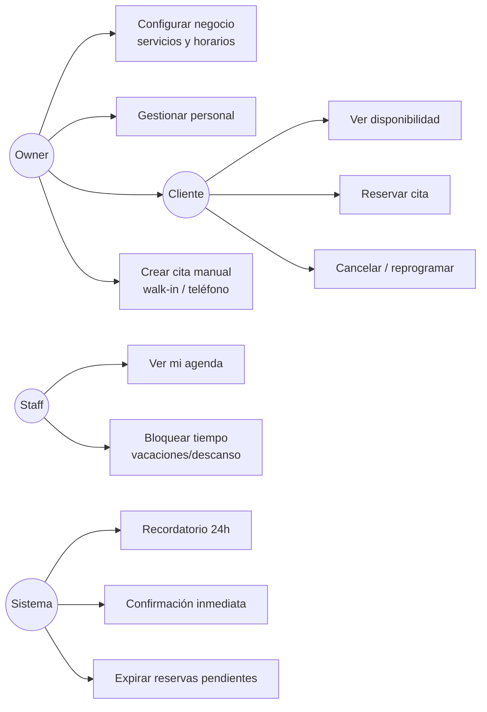
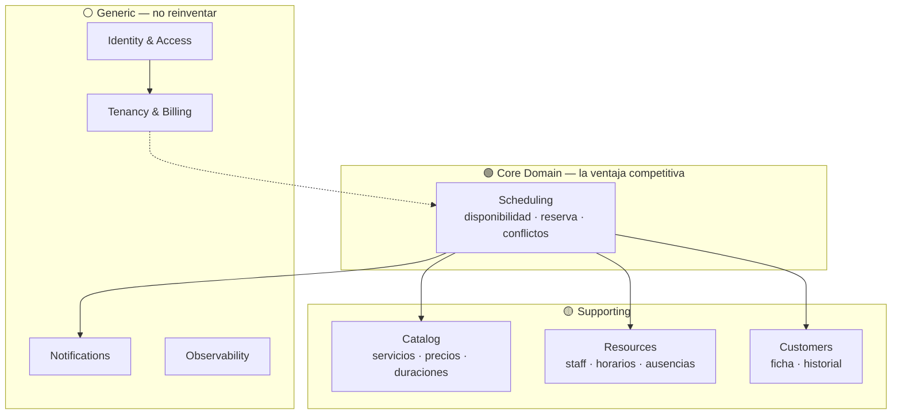
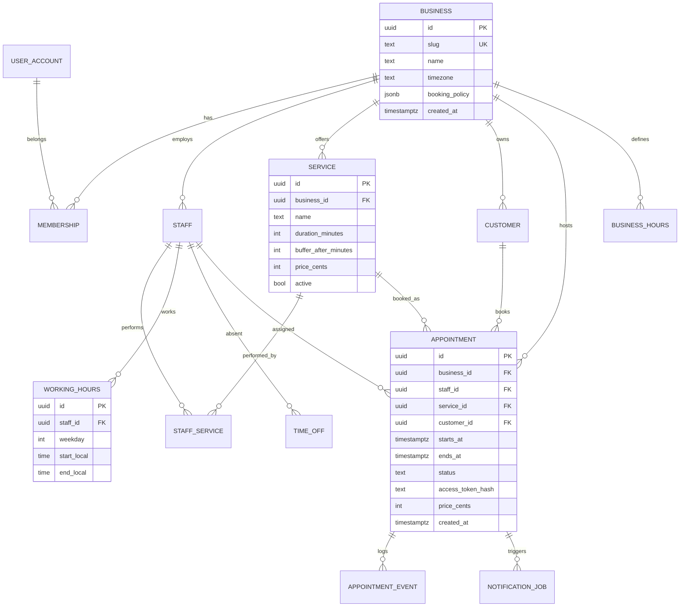
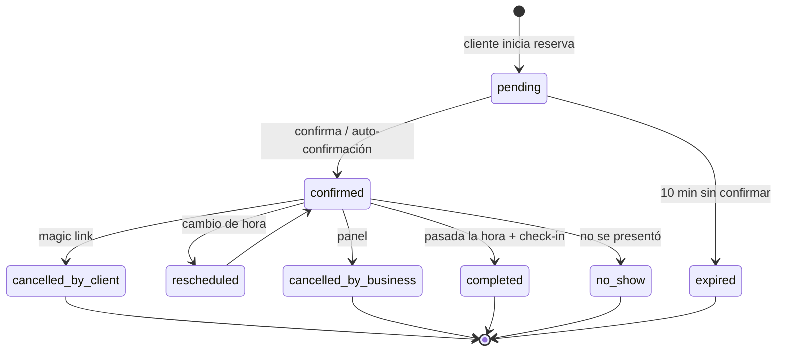
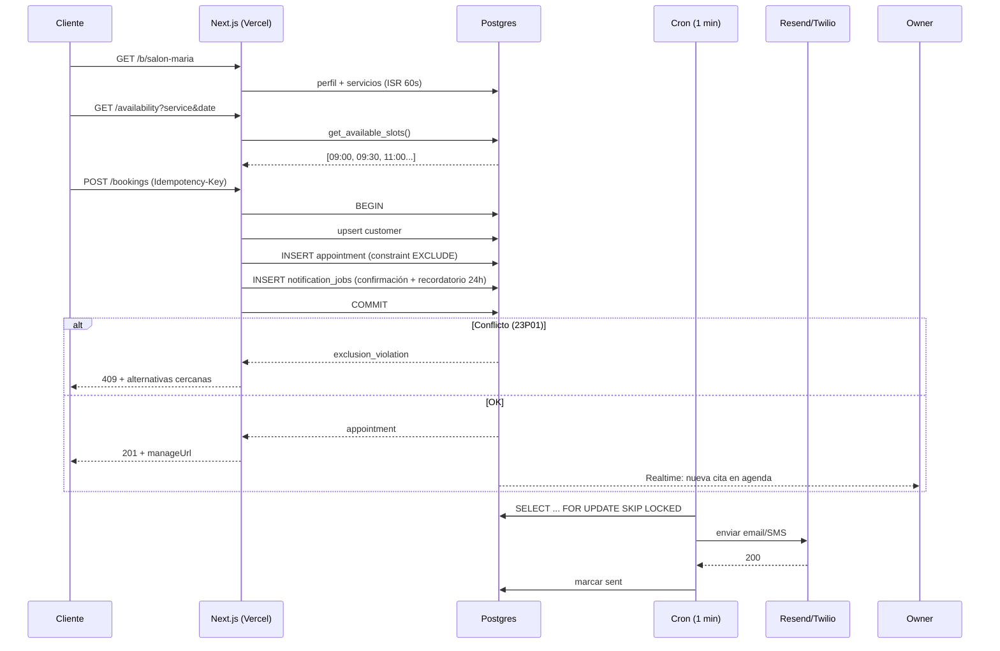
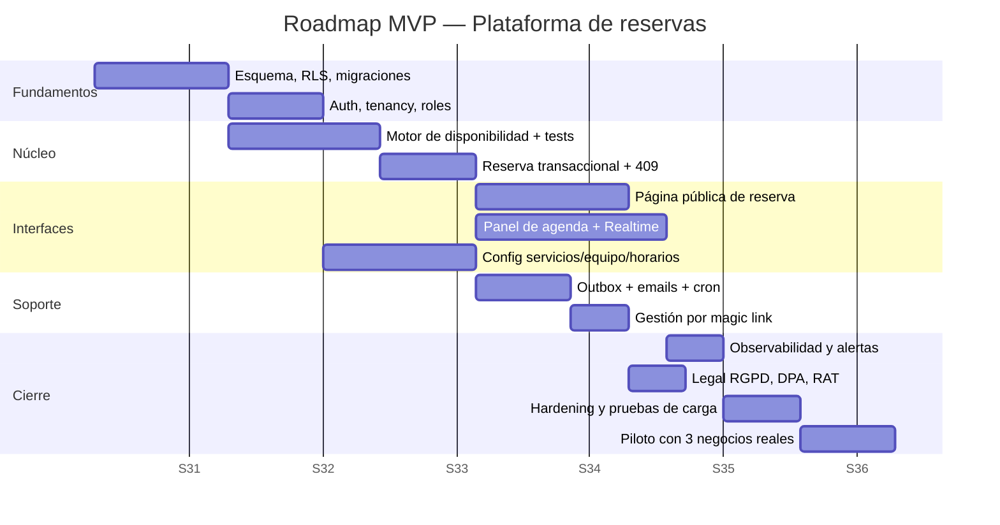

# Arquitectura Técnica — Plataforma de Reservas B2B (tipo Booksy)

**Autor:** Claude (Arquitectura) · **Cliente:** Dani / Qodeia
**Fecha:** 2 de agosto de 2026 · **Versión:** 1.0 · **Estado:** Propuesta para revisión

---

## 0. Parámetros de entrada (lo que sé y lo que NO)

### 0.1 Confirmado por ti

| Parámetro | Valor |
|---|---|
| Tipo | SaaS multi-tenant B2B, referencia funcional Booksy |
| Núcleo MVP | **Solo agenda/reservas B2B** (sin marketplace, sin POS/pagos) |
| Escala 12 meses | < 100 negocios (piloto) |
| Plazo | MVP en 4–8 semanas |
| Presupuesto | Coste mínimo |
| Equipo | 1 persona (tú) + Claude como implementador |
| Stack | Abierto — a recomendar |

### 0.2 Supuestos declarados (NO son datos tuyos — corrígeme si fallan)

Los marco explícitamente porque condicionan el diseño. Cada uno lleva su impacto si resulta falso.

| # | Supuesto | Impacto si es falso |
|---|---|---|
| S1 | Mercado España, un solo huso (Europe/Madrid), idioma es-ES | Multi-timezone real → cambia el modelo de disponibilidad (§4.4) |
| S2 | **[Actualizado]** Cualquier negocio con cita previa (peluquería, gimnasio, asesoría, taller, academia...), explícitamente **excluida sanidad** (médicos, psicólogos, dentistas, fisios) | Si algún día entra sanidad → LOPDGDD datos de salud, cifrado a nivel campo, cambia §8 |
| S3 | Negocio medio: 1 local, 1–5 profesionales, ~200 citas/mes | 10× más citas cambia §12 pero no la arquitectura |
| S4 | Los clientes finales reservan sin cuenta (guest booking + magic link) | Cuentas obligatorias → añade fricción y un dominio de identidad |
| S5 | Sin cobro online en MVP; pago en el local | Pagos en MVP → PSD2/SCA, Stripe Connect, +2 semanas mínimo |
| S6 | Sin app nativa en MVP; PWA responsive | App nativa → +6–10 semanas y ciclo de review de stores |

### 0.3 Preguntas abiertas que NO bloquean el MVP

Las dejo registradas para no inventarlas; puedes contestarlas en la fase de construcción: política de cancelación (¿ventana mínima?), gestión de depósitos/no-show, si los profesionales necesitan login propio o basta el del dueño, e integración con Google Calendar.

---

## 1. Análisis funcional

### 1.1 Actores

| Actor | Descripción | Canal |
|---|---|---|
| **Owner** | Dueño del negocio. Configura servicios, horarios, personal. Ve todo. | Panel web |
| **Staff** | Profesional. Ve y gestiona su propia agenda. | Panel web (móvil) |
| **Cliente final** | Reserva, cancela, reprograma. Sin cuenta obligatoria. | Página pública de reserva |
| **Sistema** | Recordatorios, limpieza de reservas caducadas, métricas. | Cron/worker |
| **Platform Admin** | Tú. Alta de negocios, soporte, feature flags. | Panel interno |

### 1.2 Casos de uso del MVP



### 1.3 Alcance — dentro / fuera

| ✅ En MVP | ❌ Fuera de MVP (roadmap) | ⛔ Fuera de visión |
|---|---|---|
| Multi-tenant, multi-staff | Marketplace/descubrimiento | Gestión de nóminas |
| Catálogo de servicios (duración, precio, buffer) | Pagos online y depósitos | Contabilidad/facturación fiscal completa |
| Horarios recurrentes + excepciones | Inventario y POS | Videollamada/teleconsulta |
| Reserva pública sin cuenta | Paquetes, bonos, membresías | |
| Cancelar/reprogramar por magic link | App nativa iOS/Android | |
| Notificaciones email (+SMS opcional) | Marketing automation, reseñas | |
| Ficha básica de cliente e historial | Informes avanzados / BI | |
| Panel de agenda día/semana | Sincronización Google Calendar | |

### 1.4 Reglas de negocio críticas

| ID | Regla | Por qué importa |
|---|---|---|
| RN-01 | Un profesional no puede tener dos citas solapadas | Corrupción de datos → pérdida de confianza inmediata |
| RN-02 | Duración de cita = duración del servicio + buffer posterior | Limpieza/preparación entre clientes |
| RN-03 | Solo se ofertan huecos dentro del horario laboral menos ausencias | |
| RN-04 | Antelación mínima configurable (p. ej. 2h) y máxima (p. ej. 60 días) | Evita reservas imposibles |
| RN-05 | Cita cancelada libera el hueco de forma inmediata | |
| RN-06 | Toda hora se almacena en UTC; se presenta en la zona del negocio | DST: octubre/marzo rompen sistemas mal diseñados |
| RN-07 | Reserva pendiente sin confirmar expira a los 10 min | Evita bloqueo malicioso de agenda |

---

## 2. Requisitos no funcionales

| ID | Categoría | Requisito | Objetivo MVP | Cómo se mide |
|---|---|---|---|---|
| RNF-01 | Rendimiento | p95 consulta de disponibilidad | < 300 ms | Trazas APM |
| RNF-02 | Rendimiento | p95 creación de cita | < 500 ms | Trazas APM |
| RNF-03 | Rendimiento | LCP página pública de reserva | < 2,0 s en 4G | Vercel Speed Insights |
| RNF-04 | Disponibilidad | Uptime del servicio de reserva | 99,5 % (≈3,6 h/mes) | Monitor externo |
| RNF-05 | Consistencia | Doble reserva | **0 tolerancia** — garantía en BD | Test de carga concurrente |
| RNF-06 | Durabilidad | RPO / RTO | RPO ≤ 24 h (MVP) / RTO ≤ 4 h | Ensayo de restauración |
| RNF-07 | Seguridad | Aislamiento entre tenants | Total, aplicado en BD | Tests automáticos de RLS |
| RNF-08 | Cumplimiento | RGPD + LOPDGDD, datos en UE | Obligatorio | Auditoría §8.8 |
| RNF-09 | Escalabilidad | De 100 → 1.000 negocios sin rediseño | Vertical + réplicas | Prueba de carga |
| RNF-10 | Mantenibilidad | 1 desarrollador entiende y opera el sistema | Deploy < 10 min | — |
| RNF-11 | Accesibilidad | WCAG 2.1 AA en flujo público de reserva | Objetivo | axe CI |
| RNF-12 | Coste | Infra fija MVP | < 100 €/mes | Facturación |

> **Trade-off central del proyecto:** con 1 desarrollador, 8 semanas y coste mínimo, la restricción dominante no es la escala — es el **presupuesto cognitivo y operativo de una sola persona**. Toda decisión posterior se pondera con ese criterio.

---

## 3. Identificación de dominios (DDD)

### 3.1 Mapa de contextos



### 3.2 Prioridad de esfuerzo

| Dominio | Clasificación | Estrategia | % del esfuerzo |
|---|---|---|---|
| Scheduling | **Core** | Construir a mano, con máxima calidad y tests | 40 % |
| Resources | Supporting | Construir, modelo simple | 15 % |
| Catalog | Supporting | Construir, CRUD | 10 % |
| Customers | Supporting | Construir, mínimo | 10 % |
| Identity | Generic | **Comprar/usar** (Supabase Auth) | 5 % |
| Notifications | Generic | **Comprar** (Resend/Twilio) + outbox propio | 15 % |
| Observability | Generic | **Comprar** (Sentry, tier gratuito) | 5 % |

**Conclusión:** el único sitio donde merece la pena ser original es el motor de disponibilidad. En todo lo demás, integrar.

---

## 4. Modelado de datos

### 4.1 Modelo entidad-relación



### 4.2 Decisiones de modelado clave

**Rangos temporales, no pares de columnas.** Las citas se modelan como `tstzrange` para poder usar restricciones de exclusión nativas de Postgres (§4.3).

**Horarios laborales en hora local, citas en UTC.** `working_hours` guarda `time` local + `weekday` porque "los martes abro a las 9:00" es una regla local que debe sobrevivir al cambio de hora. Las citas guardan `timestamptz` (UTC absoluto) porque un instante concreto no debe moverse nunca. El `timezone` del negocio es la bisagra entre ambos mundos.

**Snapshot de precio y duración en la cita.** `appointment` copia `price_cents` y la duración en el momento de reservar. Si el negocio sube el precio mañana, el histórico no se falsea.

**Cliente sin cuenta.** `customer` pertenece al negocio (no es un usuario global). Email+teléfono con índice único parcial por negocio para deduplicar.

### 4.3 Garantía de no-solapamiento (la pieza crítica)

```sql
CREATE EXTENSION IF NOT EXISTS btree_gist;

ALTER TABLE appointments
ADD CONSTRAINT appointments_no_overlap
EXCLUDE USING gist (
  staff_id WITH =,
  tstzrange(starts_at, ends_at, '[)') WITH &&
) WHERE (status IN ('pending', 'confirmed'));
```

Esto hace que la doble reserva sea **imposible a nivel de motor de base de datos**, no a nivel de código de aplicación. Aunque dos peticiones lleguen en el mismo milisegundo desde dos regiones distintas, Postgres rechaza la segunda con `exclusion_violation` (SQLSTATE 23P01), que se traduce a un HTTP 409.

> **Trade-off:** si eliges validar solapamientos en la capa de aplicación renuncias a esta garantía, porque cualquier comprobación *leer-luego-escribir* tiene una ventana de carrera. El coste es un índice GiST adicional (escrituras ~10–15 % más lentas) — irrelevante a esta escala, y barato incluso a 100×.

### 4.4 Máquina de estados de la cita



Solo `pending` y `confirmed` ocupan hueco (cláusula `WHERE` de la restricción). Cancelar libera automáticamente sin borrar el registro — el histórico se conserva para métricas de no-show.

### 4.5 Índices previstos

| Tabla | Índice | Justificación |
|---|---|---|
| appointments | `(business_id, starts_at)` | Vista de agenda por día/semana |
| appointments | `(staff_id, starts_at)` | Agenda individual y cálculo de huecos |
| appointments | GiST de la restricción de exclusión | Detección de solapamiento |
| appointments | `(customer_id, starts_at DESC)` | Historial del cliente |
| appointments | `(access_token_hash)` único | Acceso por magic link |
| working_hours | `(staff_id, weekday)` | Cálculo de disponibilidad |
| time_off | GiST `(staff_id, rango)` | Resta de ausencias |
| customers | único parcial `(business_id, lower(email))` | Deduplicación |
| notification_jobs | `(status, scheduled_for)` parcial | Barrido del worker |

---

## 5. Componentes y decisiones de arquitectura

### 5.1 ADR-001 — Estilo arquitectónico

| Criterio (peso) | A: Monolito modular | B: Microservicios | C: Funciones sueltas |
|---|---|---|---|
| Velocidad a MVP (30 %) | 10 | 3 | 7 |
| Carga operativa 1 dev (25 %) | 9 | 2 | 6 |
| Coste (20 %) | 9 | 3 | 8 |
| Consistencia transaccional (15 %) | 10 | 4 | 6 |
| Evolución a escala (10 %) | 7 | 9 | 5 |
| **Score ponderado** | **9,25** | **3,35** | **6,55** |

**Pros A:** una transacción de BD cubre reserva+cliente+notificación; un deploy; un log; refactor trivial. **Contras A:** un fallo tumba todo; escalado indivisible.
**Pros B:** escalado y despliegue independientes. **Contras B:** reserva pasa a ser transacción distribuida (sagas) por un problema que no tienes; 5× el trabajo de infra para 100 clientes.
**Pros C:** granularidad, coste por uso. **Contras C:** lógica de dominio dispersa, arranques en frío, difícil de razonar.

> ✅ **RECOMENDACIÓN: A — Monolito modular** con fronteras de módulo estrictas (`scheduling/`, `catalog/`, `resources/`, `crm/`, `notifications/`), cada uno con su interfaz pública. Si eliges microservicios renuncias a la transaccionalidad ACID de la reserva y a tu propia velocidad, a cambio de una escalabilidad que a 100 negocios no vas a necesitar. Las fronteras internas te dejan extraer un servicio más adelante si algún módulo lo justifica.

### 5.2 ADR-002 — Plataforma y stack

| Criterio (peso) | A: Next.js + Supabase + Vercel | B: Node/Fastify + Postgres en Hetzner | C: Next.js + Firebase |
|---|---|---|---|
| Time-to-MVP (30 %) | 10 | 5 | 8 |
| Coste MVP (20 %) | 8 | 9 | 7 |
| Ajuste al dominio (relacional/temporal) (20 %) | 10 | 10 | 3 |
| Ops de 1 persona (15 %) | 9 | 4 | 9 |
| Portabilidad / lock-in (10 %) | 7 | 10 | 2 |
| Tu experiencia previa (5 %) | 10 | 7 | 5 |
| **Score ponderado** | **9,15** | **7,20** | **6,10** |

**Contra decisiva de C (Firebase):** el dominio es intrínsecamente relacional y temporal — rangos, exclusión, joins de disponibilidad. Firestore no ofrece restricciones de exclusión ni consultas de rango sobre múltiples dimensiones; tendrías que implementar el anti-solapamiento a mano con transacciones y aún así con garantías más débiles. Descartado por incompatibilidad de modelo de datos, no por preferencia.

**Contra de B:** es la opción más barata y portable, pero te compras backups, parcheo del SO, réplicas, pooling, autenticación y almacenamiento — semanas de trabajo que salen directamente del presupuesto de 8 semanas.

> ✅ **RECOMENDACIÓN: A.** Next.js 15 (App Router) sobre Vercel + Supabase (Postgres 15 + Auth + Storage + Realtime), región **EU (Frankfurt)** por RGPD. Es Postgres puro por debajo: el motor de disponibilidad se escribe en SQL estándar y es portable. Si eliges Supabase renuncias a control de bajo nivel del servidor y aceptas un proveedor más en la cadena de subencargados RGPD; a cambio obtienes Auth, RLS, backups y realtime el día 1. **Mitigación de lock-in:** toda la lógica de dominio en migraciones SQL y funciones Postgres, cero dependencia del SDK propietario en el núcleo → la salida sería un `pg_dump` y un pooler.

### 5.3 ADR-003 — Estrategia de multi-tenancy

| Criterio (peso) | A: BD compartida + RLS | B: Schema por tenant | C: BD por tenant |
|---|---|---|---|
| Coste a 100–1.000 tenants (30 %) | 10 | 7 | 2 |
| Fuerza del aislamiento (25 %) | 7 | 8 | 10 |
| Complejidad de migraciones (25 %) | 10 | 4 | 2 |
| Consultas cross-tenant / analítica (10 %) | 10 | 5 | 2 |
| Ruido entre vecinos (10 %) | 6 | 7 | 10 |
| **Score ponderado** | **8,85** | **6,35** | **4,20** |

> ✅ **RECOMENDACIÓN: A — BD compartida con `business_id` + Row Level Security**, con dos condiciones no negociables: (1) *toda* tabla de negocio lleva `business_id NOT NULL` y política RLS, sin excepción; (2) hay un test automático que, por cada tabla, verifica que RLS está activo y que un tenant no puede leer datos de otro — corre en CI y bloquea el merge. Si eliges RLS renuncias al aislamiento físico: un error en una política es una fuga de datos entre clientes. Ese riesgo se compra con tests, no con confianza.

### 5.4 ADR-004 — Cálculo de disponibilidad

| Criterio (peso) | A: Cálculo bajo demanda (SQL) | B: Slots materializados | C: Híbrido (cálculo + caché corta) |
|---|---|---|---|
| Corrección / frescura (35 %) | 10 | 5 | 9 |
| Simplicidad (30 %) | 9 | 4 | 7 |
| Latencia a escala (20 %) | 6 | 10 | 9 |
| Coste (15 %) | 9 | 6 | 8 |
| **Score ponderado** | **8,60** | **6,05** | **8,35** |

**Contra de B:** materializar huecos exige invalidar en cascada cada vez que cambia un horario, se añade una ausencia o cambia la duración de un servicio. Es la fuente clásica de bugs de "aparece un hueco que no existe".

> ✅ **RECOMENDACIÓN: A ahora, C cuando duela.** Una función SQL `get_available_slots(business_id, service_id, staff_id, from, to)` que genera la rejilla de horarios, resta ausencias y citas existentes, y aplica la política de antelación. A 100 negocios esto son milisegundos. Cuando p95 supere 300 ms, se envuelve en caché de 60 s con invalidación por `business_id` — cambio localizado en una función, sin tocar el modelo.

### 5.5 ADR-005 — Notificaciones y trabajos programados

| Criterio (peso) | A: Outbox en Postgres + Vercel Cron | B: Inngest / Trigger.dev | C: Cola gestionada (SQS/QStash) |
|---|---|---|---|
| Coste (30 %) | 10 | 7 | 8 |
| Fiabilidad / reintentos (25 %) | 8 | 10 | 9 |
| Simplicidad operativa (25 %) | 9 | 8 | 6 |
| Observabilidad (20 %) | 6 | 10 | 7 |
| **Score ponderado** | **8,50** | **8,45** | **7,55** |

Empate técnico prácticamente perfecto. Desempata el coste fijo y el hecho de que la tabla outbox vive dentro de la misma transacción que la cita — imposible crear una cita sin encolar su confirmación, y viceversa.

> ✅ **RECOMENDACIÓN: A.** Tabla `notification_jobs` (patrón transactional outbox) + un cron cada minuto que reclama trabajos con `FOR UPDATE SKIP LOCKED`, con `idempotency_key` única y backoff exponencial. Si eliges A renuncias al panel de observabilidad de Inngest; se compensa con un dashboard propio de trabajos fallidos y una alerta si la cola envejece. Migrar a B después es reemplazar el worker, no el modelo.

### 5.6 Diagrama de contenedores (C4 nivel 2)

```
┌──────────────────────────────────────────────────────────────────────┐
│                            NAVEGADOR / PWA                           │
│  ┌────────────────────┐  ┌────────────────────┐  ┌────────────────┐  │
│  │ Página pública de  │  │ Panel de negocio   │  │ Panel admin    │  │
│  │ reserva /b/[slug]  │  │ /app (Owner/Staff) │  │ /admin         │  │
│  └─────────┬──────────┘  └─────────┬──────────┘  └───────┬────────┘  │
└────────────┼───────────────────────┼─────────────────────┼───────────┘
             │ HTTPS                 │                     │
┌────────────▼───────────────────────▼─────────────────────▼───────────┐
│                     VERCEL — Next.js 15 (App Router)                 │
│  Middleware: auth · rate limit · headers de seguridad · tenant slug   │
│ ┌──────────────────────────────────────────────────────────────────┐ │
│ │ RSC + Server Actions          │  Route Handlers (/api)            │ │
│ │ ─ vistas de agenda            │  ─ POST /api/bookings             │ │
│ │ ─ formularios de config       │  ─ GET  /api/availability         │ │
│ │                               │  ─ POST /api/cron/notifications   │ │
│ └──────────────────────────────────────────────────────────────────┘ │
│ ┌──────────────────────────────────────────────────────────────────┐ │
│ │  MÓDULOS DE DOMINIO (fronteras estrictas, mismo despliegue)      │ │
│ │  scheduling │ catalog │ resources │ crm │ notifications │ tenancy │ │
│ └──────────────────────────────────────────────────────────────────┘ │
└──────┬──────────────────┬──────────────────┬─────────────────┬───────┘
       │                  │                  │                 │
┌──────▼──────┐  ┌────────▼────────┐  ┌──────▼──────┐  ┌───────▼──────┐
│  SUPABASE   │  │    RESEND       │  │   TWILIO    │  │   UPSTASH    │
│  EU-Central │  │    (email)      │  │ (SMS, opc.) │  │ Redis (rate  │
│ ─ Postgres  │  └─────────────────┘  └─────────────┘  │  limit/caché)│
│ ─ Auth/JWT  │  ┌─────────────────┐  ┌─────────────┐  └──────────────┘
│ ─ RLS       │  │     SENTRY      │  │  BETTERSTACK│
│ ─ Storage   │  │  errores/trazas │  │   uptime    │
│ ─ Realtime  │  └─────────────────┘  └─────────────┘
└─────────────┘
```

---

## 6. Interfaces (frontend)

### 6.1 Superficies

| Superficie | Ruta | Renderizado | Prioridad |
|---|---|---|---|
| Página pública de reserva | `/b/[slug]` | RSC + islas cliente; ISR para datos del negocio | 🔴 Crítica |
| Gestión de cita (cliente) | `/r/[token]` | RSC, sin sesión, token de un solo recurso | 🔴 Crítica |
| Agenda del negocio | `/app/agenda` | Cliente (interacción intensa) + Realtime | 🔴 Crítica |
| Configuración de servicios | `/app/servicios` | RSC + Server Actions | 🟠 Alta |
| Personal y horarios | `/app/equipo` | RSC + Server Actions | 🟠 Alta |
| Clientes | `/app/clientes` | RSC, paginado servidor | 🟡 Media |
| Admin de plataforma | `/admin` | RSC, mínimo | 🟡 Media |

### 6.2 Principios de UI

- **Mobile-first en las dos puntas.** El cliente reserva desde el móvil; el profesional consulta la agenda entre cliente y cliente, de pie, con una mano.
- **El flujo de reserva son 3 pasos**: servicio → profesional+hora → datos de contacto. Cada paso extra cuesta conversión.
- **Actualización optimista con reconciliación** en la agenda: arrastrar una cita se refleja al instante y revierte con aviso si el servidor devuelve 409.
- **Realtime en la agenda** vía Supabase Realtime: si un cliente reserva mientras el dueño mira la pantalla, la cita aparece sola. Es el detalle que hace que el producto se sienta vivo, y aquí sale casi gratis.
- **Zona horaria explícita**: si el navegador del cliente está en otro huso, se muestra "14:00 (hora del local)" para evitar el fallo más caro de este dominio.

---

## 7. Diseño de API

### 7.1 Estilo

REST sobre Route Handlers para lo público y Server Actions para el panel autenticado. GraphQL se descarta: un solo consumidor, un solo equipo, ningún problema de over-fetching que justifique el coste.

### 7.2 Endpoints públicos (sin sesión)

| Método | Ruta | Descripción | Rate limit |
|---|---|---|---|
| `GET` | `/api/b/{slug}` | Perfil del negocio + servicios activos | 60/min/IP |
| `GET` | `/api/b/{slug}/availability?service&staff&from&to` | Huecos disponibles | 30/min/IP |
| `POST` | `/api/b/{slug}/bookings` | Crear cita (idempotente) | 5/min/IP, 10/h/email |
| `GET` | `/api/r/{token}` | Consultar cita por magic link | 20/min/IP |
| `POST` | `/api/r/{token}/cancel` | Cancelar | 5/min |
| `POST` | `/api/r/{token}/reschedule` | Reprogramar | 5/min |

### 7.3 Contrato de creación de cita

```http
POST /api/b/salon-maria/bookings
Idempotency-Key: 7f3a91c2-...
Content-Type: application/json

{
  "serviceId": "uuid",
  "staffId": "uuid | null",          // null = cualquiera disponible
  "startsAt": "2026-08-14T09:30:00Z", // SIEMPRE UTC en el contrato
  "customer": { "name": "...", "email": "...", "phone": "+34..." },
  "notes": "string?",
  "consent": { "terms": true, "marketing": false }
}
```

**Respuestas:**

| Código | Situación | Cuerpo |
|---|---|---|
| `201` | Creada | `{ id, status, startsAt, endsAt, manageUrl }` |
| `409` | Hueco ya ocupado (carrera perdida) | `{ error: "SLOT_TAKEN", alternatives: [...] }` |
| `422` | Fuera de horario / antelación insuficiente | `{ error, field }` |
| `429` | Rate limit | `Retry-After` |
| `410` | Servicio o profesional desactivado | |

El 409 **devuelve alternativas cercanas**: convertir un error en una segunda oportunidad de conversión es una decisión de producto que hay que meter en la API desde el principio.

### 7.4 Idempotencia

Toda escritura pública acepta `Idempotency-Key`. La clave se persiste con hash del cuerpo y la respuesta durante 24 h. Un doble clic o un reintento de red devuelven la misma cita, no dos. Es barato ahora e imposible de retrofitar limpiamente después.

### 7.5 Contrato de errores (uniforme)

```json
{ "error": "SLOT_TAKEN", "message": "Ese hueco acaba de ocuparse",
  "requestId": "req_...", "details": {} }
```

`requestId` se propaga a Sentry y a los logs: el usuario te dice ese código y encuentras la traza exacta.

---

## 8. Seguridad

### 8.1 Modelo de amenazas (STRIDE abreviado)

| Amenaza | Vector concreto en este sistema | Mitigación |
|---|---|---|
| Spoofing | Cancelar la cita de otro adivinando el token | Token de 256 bits, almacenado hasheado, un solo uso para acciones destructivas |
| Tampering | Manipular `startsAt` para saltarse el horario | Revalidación íntegra en servidor; el cliente nunca es fuente de verdad |
| Repudio | "Yo no cancelé esa cita" | `appointment_events` inmutable con actor, IP y timestamp |
| Divulgación | Tenant A leyendo clientes de B | RLS + tests de aislamiento en CI |
| Divulgación | Enumerar clientes vía endpoint público | El endpoint público **nunca** devuelve datos de clientes; solo huecos |
| DoS | Bot reservando toda la agenda | Rate limit + expiración de `pending` + captcha invisible sobre umbral |
| Elevación | Staff editando la configuración del negocio | Autorización por rol comprobada en BD, no en la UI |

### 8.2 OWASP Top 10 (2021) — cobertura

| # | Riesgo | Estado en el diseño |
|---|---|---|
| A01 | Control de acceso roto | RLS en BD + comprobación de rol en servidor + tests automáticos. **Mayor riesgo del proyecto.** |
| A02 | Fallos criptográficos | TLS 1.3 obligatorio, HSTS, cifrado en reposo (Supabase), tokens hasheados con SHA-256 |
| A03 | Inyección | Consultas parametrizadas siempre; SQL dinámico prohibido; funciones con `search_path` fijado |
| A04 | Diseño inseguro | Este documento + revisión por roles (§20) |
| A05 | Mala configuración | Cabeceras CSP/HSTS/X-Frame-Options en middleware; sin claves de servicio en cliente |
| A06 | Componentes vulnerables | Dependabot + `pnpm audit` en CI, bloqueo en severidad alta |
| A07 | Fallos de identificación | Supabase Auth, contraseñas gestionadas, MFA opcional para Owner, sesiones rotativas |
| A08 | Integridad de software/datos | Despliegues firmados desde Git, migraciones versionadas y revisadas |
| A09 | Fallos de logging | Logs estructurados + Sentry + auditoría de acciones sensibles |
| A10 | SSRF | Sin fetch de URLs proporcionadas por el usuario en el MVP |

### 8.3 Autenticación y autorización

| Aspecto | Decisión |
|---|---|
| Owner / Staff | Supabase Auth: email+contraseña y magic link. MFA (TOTP) opcional, recomendado a Owner |
| Cliente final | Sin cuenta. Magic link firmado por cita |
| Sesión | JWT de acceso corto (1 h) + refresh rotativo en cookie `httpOnly`, `Secure`, `SameSite=Lax` |
| Roles | `owner`, `staff`, `platform_admin` en tabla `memberships` |
| Autorización | Función `auth_business_role(business_id)` consultada por las políticas RLS |
| Secretos | Variables de entorno en Vercel; la `service_role` key **jamás** cruza al cliente; rotación semestral |

**Matriz de permisos:**

| Acción | Owner | Staff | Cliente | Anónimo |
|---|---|---|---|---|
| Ver agenda completa del negocio | ✅ | ❌ (solo la propia) | ❌ | ❌ |
| Crear/editar servicios y precios | ✅ | ❌ | ❌ | ❌ |
| Gestionar personal y horarios | ✅ | Solo sus ausencias | ❌ | ❌ |
| Ver ficha y teléfono de clientes | ✅ | Solo de sus citas | Solo la propia | ❌ |
| Crear cita | ✅ | ✅ | ✅ (pública) | ✅ (pública) |
| Cancelar cita | ✅ | Las suyas | La suya (token) | ❌ |
| Ver disponibilidad | ✅ | ✅ | ✅ | ✅ |

### 8.4 Rate limiting y abuso

| Superficie | Límite | Mecanismo |
|---|---|---|
| Disponibilidad | 30/min/IP | Upstash Redis, ventana deslizante en middleware |
| Creación de cita | 5/min/IP + 10/h/email | Redis + comprobación en BD |
| Login | 5 intentos/15 min, backoff | Supabase Auth + bloqueo propio |
| Global por IP | 300/min | Middleware |
| Anti-bot | Turnstile invisible si se supera umbral | Cloudflare Turnstile (gratis) |

Ante DDoS volumétrico la mitigación es el borde de Vercel/Cloudflare; a esta escala no se justifica nada más.

### 8.5 Protecciones web

- **XSS:** React escapa por defecto; `dangerouslySetInnerHTML` prohibido por lint; CSP con `nonce` en scripts.
- **CSRF:** Server Actions de Next.js llevan protección de origen; las cookies son `SameSite=Lax`; las mutaciones públicas usan token en cuerpo, no en cookie.
- **CORS:** la API pública sirve `Access-Control-Allow-Origin` explícito solo para el widget embebible (fase 2); en MVP, mismo origen.
- **Clickjacking:** `X-Frame-Options: DENY` salvo en la ruta del widget.

### 8.6 Cifrado y datos

| Estado | Medida |
|---|---|
| En tránsito | TLS 1.3, HSTS con preload |
| En reposo | Cifrado a nivel de disco (Supabase/AWS) |
| Tokens de acceso | Solo se guarda `sha256(token)`; el original vive únicamente en el enlace |
| Contraseñas | Gestionadas por Supabase Auth (bcrypt) |
| Notas de cita | Campo libre — advertencia en UI de no incluir datos de salud (§8.8) |

### 8.7 Backups y recuperación

| Escenario | RPO | RTO | Procedimiento |
|---|---|---|---|
| Corrupción lógica (borrado en masa) | ≤ 24 h (MVP) / ≤ 2 min (Pro con PITR) | 2 h | Restauración a un punto en el tiempo |
| Caída de región Supabase | 24 h | 4 h | Restaurar dump en proyecto nuevo |
| Vercel caído | 0 | — | Solo lectura degradada; se acepta |
| Borrado accidental de tenant | 0 | 1 h | Borrado lógico con retención de 30 días |

**Regla:** un backup no probado no es un backup. Ensayo de restauración obligatorio en la semana 7 y trimestral después.

### 8.8 Cumplimiento RGPD / LOPDGDD

| Requisito | Implementación |
|---|---|
| Base jurídica | Ejecución de contrato para la cita; **consentimiento separado** para marketing |
| Rol | Tú eres **encargado del tratamiento**; el negocio es responsable → hace falta **contrato de encargo (DPA)** con cada negocio |
| Subencargados | Supabase, Vercel, Resend, Twilio, Sentry, Upstash → lista pública y DPAs firmados |
| Residencia | Todos los servicios configurados en región UE cuando exista; documentar transferencias con SCC |
| Minimización | Nombre, email, teléfono. **Sin datos de salud** (categoría especial art. 9) — advertencia explícita en el campo de notas |
| Derecho de supresión | Endpoint de borrado: anonimiza al cliente conservando el registro financiero/agregado |
| Retención | Citas 5 años (obligación mercantil); logs 90 días; tokens caducados purga a 30 días |
| RAT | Registro de actividades de tratamiento redactado antes del primer cliente real |
| Notificación de brechas | Runbook con plazo de 72 h a la AEPD |
| Consentimiento SMS/email marketing | Doble opt-in, baja en cada mensaje (LSSI-CE) |

⚠️ **No soy abogado.** Esta tabla es un mapa de ingeniería de requisitos, no asesoramiento legal. Antes de facturar al primer cliente, revisa el DPA y el RAT con un especialista en protección de datos: el coste (unos cientos de euros) es despreciable frente a una sanción.

---

## 9. Persistencia

### 9.1 Elección de motor

Postgres 15, sin discusión razonable: rangos temporales nativos, restricciones de exclusión, RLS, `pg_cron`, JSONB para políticas flexibles y transacciones ACID. Ninguna base documental cubre RN-01 con la misma solidez.

### 9.2 Patrones de acceso

| Patrón | Frecuencia | Estrategia |
|---|---|---|
| Consultar disponibilidad | Muy alta (~70 % de lecturas) | Función SQL optimizada + índices; caché en fase 2 |
| Cargar agenda del día | Alta | Índice `(business_id, starts_at)`, ventana acotada |
| Insertar cita | Media | Transacción única con outbox |
| Historial de cliente | Baja | Índice dedicado |
| Métricas agregadas | Baja | Vista materializada refrescada de noche (fase 2) |

### 9.3 Migraciones

Migraciones SQL versionadas en el repositorio (`supabase/migrations`), aplicadas en CI, **siempre compatibles hacia atrás** (expand → migrate → contract). Nunca un `DROP COLUMN` en el mismo despliegue que retira su uso. Entorno `staging` obligatorio: es la red de seguridad de un equipo de una persona.

### 9.4 Datos calientes vs fríos

A esta escala no hay archivado que hacer. Estimación: 100 negocios × 200 citas/mes × 12 = 240.000 filas/año ≈ 120 MB con índices. Postgres ni se despeina. La política de archivado se revisa al superar los 50 millones de filas — momento que a este ritmo llega en 2224.

---

## 10. Caching

### 10.1 Estrategia por capas

| Capa | Qué se cachea | TTL | Invalidación |
|---|---|---|---|
| CDN (Vercel Edge) | Assets estáticos, fuentes, imágenes | 1 año, hash en nombre | Inmutable |
| ISR | Perfil público del negocio `/b/[slug]` | 60 s + revalidación bajo demanda | Tag `business:{id}` al guardar cambios |
| RSC / React cache | Datos dentro de una misma petición | Petición | Automática |
| Redis (fase 2) | Resultados de disponibilidad | 60 s | Tag `avail:{business}:{staff}:{day}` al crear/cancelar cita |
| Navegador | Rejilla de huecos ya cargada | Sesión | Al cambiar de fecha |

### 10.2 Regla de oro

**La disponibilidad no se cachea agresivamente en el MVP.** Un hueco fantasma —mostrar libre lo que ya está ocupado— produce un 409 en la cara del cliente y destruye la confianza más de lo que ahorra en latencia. Se empieza sin caché de disponibilidad y se introduce solo cuando la métrica lo pida, con invalidación por evento (no solo por TTL).

> **Trade-off:** si eliges cachear disponibilidad desde el día 1 ganas latencia y ahorras cómputo, pero renuncias a la frescura y compras un conjunto de bugs de invalidación que son los más difíciles de reproducir de todo el sistema. A 100 negocios no hay nada que ganar.

---

## 11. Mensajería y trabajos asíncronos

### 11.1 Flujo de reserva completo



### 11.2 Diseño del outbox

```sql
CREATE TABLE notification_jobs (
  id uuid PRIMARY KEY DEFAULT gen_random_uuid(),
  business_id uuid NOT NULL REFERENCES businesses(id),
  appointment_id uuid REFERENCES appointments(id) ON DELETE CASCADE,
  channel text NOT NULL,            -- email | sms | push
  template text NOT NULL,           -- confirmation | reminder_24h | cancellation
  payload jsonb NOT NULL,
  scheduled_for timestamptz NOT NULL,
  status text NOT NULL DEFAULT 'pending',  -- pending|sent|failed|cancelled
  attempts int NOT NULL DEFAULT 0,
  last_error text,
  idempotency_key text UNIQUE NOT NULL,
  sent_at timestamptz
);
CREATE INDEX ON notification_jobs (scheduled_for)
  WHERE status = 'pending';
```

**Propiedades que aporta:**
- Atomicidad cita↔notificación (misma transacción, sin dual-write).
- Idempotencia: un reintento del cron nunca duplica un SMS (que cuesta dinero real).
- Cancelar una cita marca sus trabajos futuros como `cancelled` → nadie recibe un recordatorio de una cita anulada, el fallo más embarazoso de este tipo de producto.
- Reintentos con backoff: 1 min → 5 min → 30 min → fallo definitivo con alerta.

### 11.3 Trabajos programados

| Job | Frecuencia | Función |
|---|---|---|
| `dispatch-notifications` | cada minuto | Envía trabajos vencidos |
| `expire-pending` | cada 5 min | `pending` > 10 min → `expired` |
| `mark-no-shows` | cada hora | Citas confirmadas pasadas +2 h sin cerrar → sugerencia de no-show |
| `purge-tokens` | diaria | Borra tokens caducados |
| `daily-digest` | diaria 07:00 local | Resumen del día al Owner |
| `refresh-metrics` | diaria 03:00 | Vista materializada de KPIs |

⚠️ **Vercel Cron no garantiza ejecución exacta ni entrega única.** Por eso todo job es idempotente y reclama trabajo con `SKIP LOCKED`. Además, una alerta salta si el trabajo pendiente más antiguo supera los 5 minutos — así te enteras de que el cron ha muerto antes de que lo hagan tus clientes.

### 11.4 Canales de notificación — análisis de coste

| Criterio (peso) | A: Email (Resend) | B: SMS (Twilio) | C: WhatsApp Business |
|---|---|---|---|
| Coste por mensaje (35 %) | 10 | 2 | 5 |
| Tasa de apertura / eficacia (30 %) | 5 | 10 | 9 |
| Complejidad de integración (20 %) | 10 | 8 | 3 |
| Fricción regulatoria (15 %) | 9 | 7 | 5 |
| **Score ponderado** | **8,35** | **6,35** | **5,90** |

Las cifras: 100 negocios × 200 citas/mes = **20.000 recordatorios/mes**. A precio de SMS en España (orden de magnitud 0,05–0,09 €/mensaje, **verifica la tarifa actual**), eso son **1.000–1.800 €/mes** — entre 10 y 20 veces toda tu infraestructura. Es, con diferencia, la partida que decide la viabilidad económica del producto.

> ✅ **RECOMENDACIÓN: email por defecto + push PWA; SMS como complemento de pago repercutido al negocio.** Si eliges SMS gratuito para todos renuncias al margen del producto entero: el recordatorio SMS es el rasgo más apreciado por los negocios y también el más caro, así que debe ser una palanca de precio (add-on o plan superior), no un regalo. Diseña `notification_jobs` con `channel` desde el día 1 para que activar SMS por negocio sea un flag, no una refactorización.

---

## 12. Escalabilidad

### 12.1 Dimensionado real del MVP

| Métrica | Cálculo | Resultado |
|---|---|---|
| Negocios | Dato | 100 |
| Citas/mes | 100 × 200 | 20.000 |
| Escrituras/s (media) | 20.000 / 2,6 M s | **0,008 rps** |
| Lecturas de disponibilidad/mes | ~15 consultas por reserva completada | 300.000 |
| Lecturas/s (media) | | **0,12 rps** |
| Pico (lunes 09:00, ×20 de media) | | **~3 rps** |
| Volumen de datos año 1 | | **< 500 MB** |

**Lectura honesta de estos números:** el sistema está tres órdenes de magnitud por debajo de lo que una sola instancia de Postgres pequeña aguanta. Cualquier arquitectura distribuida aquí sería puro teatro. El trabajo real de esta fase es *corrección* (no duplicar citas, no perder recordatorios, no filtrar datos entre negocios), no rendimiento.

### 12.2 Camino de crecimiento

| Fase | Negocios | Cuello de botella esperado | Acción |
|---|---|---|---|
| 0 — MVP | < 100 | Ninguno | Supabase micro/small |
| 1 | 100–1.000 | Consultas de disponibilidad | Índices + caché Redis 60 s |
| 2 | 1.000–5.000 | CPU de Postgres en lecturas | Compute add-on + réplica de lectura |
| 3 | 5.000–20.000 | Escrituras y contención | Particionado de `appointments` por mes; extraer worker de notificaciones |
| 4 | > 20.000 | Multi-región / latencia | Sharding por `business_id`; servicio de scheduling independiente |

Ninguna de estas acciones exige rediseño: son consecuencia directa de haber puesto `business_id` en todas partes y de haber mantenido fronteras de módulo limpias.

### 12.3 Límites conocidos del diseño

| Límite | Umbral | Mitigación futura |
|---|---|---|
| Conexiones a Postgres desde serverless | ~60 conexiones | Supavisor (pooling en modo transacción) desde el día 1 |
| Duración de función en Vercel | 60 s (Pro) | Los jobs procesan lotes acotados |
| Coste de RLS en consultas complejas | Visible a millones de filas | Envolver `auth.uid()` en subconsulta; índices sobre `business_id` |
| Un solo escritor primario | ~5.000 escrituras/s | Muy lejos; llegado el caso, particionar |

---

## 13. Deployment

### 13.1 Entornos

| Entorno | Rama | Base de datos | Uso |
|---|---|---|---|
| Local | — | Supabase local (Docker) | Desarrollo, seeds, tests |
| Preview | cada PR | Branch de Supabase o proyecto compartido | Revisión visual |
| Staging | `main` | Proyecto Supabase propio con datos sintéticos | Ensayo de migraciones |
| Producción | tag `v*` | Proyecto Supabase EU | Clientes reales |

### 13.2 Pipeline CI/CD

```
Push a PR
   ├── lint + typecheck
   ├── tests unitarios (Vitest)
   ├── tests de RLS/aislamiento (pgTAP) ← BLOQUEANTE
   ├── tests de integración (Supabase local)
   ├── build
   ├── pnpm audit (fallo en severidad alta)
   └── deploy Preview
        └── e2e Playwright contra Preview (flujo de reserva)
Merge a main
   ├── migraciones aplicadas en Staging
   ├── smoke tests
   └── deploy Staging
Tag de versión
   ├── migración de producción (expand-only, revisada a mano)
   ├── deploy Vercel producción
   └── smoke test post-deploy + notificación
```

**Rollback:** el frontend revierte en un clic (deploy inmutable de Vercel). Las migraciones **no revierten** — de ahí la regla de compatibilidad hacia atrás: el código nuevo funciona con el esquema viejo y el código viejo con el nuevo. Es la única disciplina que hace seguro desplegar solo.

### 13.3 Checklist de puesta en producción

- [ ] Región de Supabase = EU (Frankfurt) verificada
- [ ] PITR activado (plan Pro) y **restauración ensayada**
- [ ] `service_role` key solo en variables de servidor; auditado con grep en el bundle
- [ ] RLS activo en el 100 % de las tablas (consulta de verificación en CI)
- [ ] Dominio + SSL + HSTS preload
- [ ] Cabeceras de seguridad verificadas (securityheaders.com grado A)
- [ ] Sentry recibiendo errores de servidor y cliente con `requestId`
- [ ] Monitor de uptime sobre `/api/health` y sobre el flujo de reserva
- [ ] Alerta de cola de notificaciones envejecida
- [ ] Página de estado / plan de comunicación de incidencias
- [ ] Aviso legal, política de privacidad, cookies, RAT y DPA modelo publicados
- [ ] Seeds de demo para onboarding de negocios nuevos

---

## 14. Observabilidad

### 14.1 Los cuatro pilares

| Pilar | Herramienta | Coste MVP | Qué se captura |
|---|---|---|---|
| Errores | Sentry | Gratis | Excepciones servidor+cliente, con `requestId` y `businessId` (nunca PII) |
| Logs | Vercel Logs + Supabase Logs | Incluido | JSON estructurado |
| Métricas | Vercel Analytics + tabla propia de KPIs | Gratis/incluido | Latencia, conversión, salud de la cola |
| Uptime | Better Stack / UptimeRobot | Gratis | Sonda cada minuto |
| Trazas | Sentry Performance | Gratis (muestreo) | Transacciones de reserva |

### 14.2 Log estructurado — contrato

```json
{
  "level": "info", "ts": "2026-08-02T10:22:31Z",
  "requestId": "req_01J...", "businessId": "uuid",
  "userId": "uuid|null", "event": "appointment.created",
  "durationMs": 142, "outcome": "success"
}
```

**Prohibido en logs:** email, teléfono, nombre del cliente, tokens. Se registran identificadores, no personas — RGPD y sentido común coinciden aquí.

### 14.3 KPIs

| KPI | Definición | Objetivo | Fuente |
|---|---|---|---|
| Tasa de conversión de reserva | reservas / visitas a `/b/[slug]` | > 25 % | Analytics + BD |
| Tiempo hasta reservar | primer clic → 201 | < 90 s | Trazas |
| Tasa de conflicto | 409 / intentos | < 1 % | Logs |
| Entrega de notificaciones | sent / total | > 98 % | BD |
| Tasa de no-show | no_show / confirmadas | Bajar con el tiempo | BD |
| Negocios activos semanales | ≥1 cita creada en 7 días | > 80 % | BD |
| p95 de disponibilidad | | < 300 ms | Sentry |
| Error rate 5xx | | < 0,1 % | Vercel |

### 14.4 Alertas (con umbral y acción, no ruido)

| Alerta | Condición | Severidad | Acción |
|---|---|---|---|
| Reservas caídas | 0 citas en 2 h en horario comercial | 🔴 | Comprobar flujo público de inmediato |
| Cola atascada | job pendiente > 5 min | 🔴 | Revisar cron y proveedor de envío |
| Pico de 5xx | > 1 % en 5 min | 🔴 | Sentry → rollback |
| Pico de 409 | > 5 % en 15 min | 🟠 | Posible bug en disponibilidad |
| Latencia BD | p95 > 1 s | 🟠 | Revisar plan de consulta |
| Fallos de envío | > 5 % | 🟠 | Revisar proveedor / reputación |
| Gasto de SMS | > umbral mensual | 🟡 | Revisar abuso o crecimiento |

Regla anti-fatiga: si una alerta no exige una acción concreta, no es alerta — es un dashboard.

---

## 15. Roadmap

### 15.1 MVP en 8 semanas (1 persona + Claude)



| Semana | Entregable verificable |
|---|---|
| 1 | Esquema completo, RLS activo, tests de aislamiento en verde |
| 2 | `get_available_slots()` correcto incluyendo DST y ausencias |
| 3 | Reserva end-to-end por API, con 409 demostrado bajo concurrencia |
| 4 | Página pública de reserva funcional en móvil |
| 5 | Panel de agenda con Realtime + configuración de servicios/equipo |
| 6 | Emails de confirmación y recordatorio 24 h operativos |
| 7 | Observabilidad, alertas, documentos legales, restauración ensayada |
| 8 | **Piloto con 3 negocios reales** y ciclo de feedback |

**El hito que importa no es "MVP terminado" sino "tres negocios usándolo un lunes por la mañana".** Un lunes de peluquería concentra los picos, los walk-ins, las cancelaciones y los cambios de última hora — descubrirás más en ese día que en dos semanas de pruebas.

### 15.2 Después del MVP

| Fase | Cuándo | Contenido |
|---|---|---|
| 1.1 | Mes 3 | Sincronización Google Calendar, SMS de pago, widget embebible en web del negocio |
| 1.2 | Mes 4–5 | Depósitos y pagos con Stripe Connect, política de no-show |
| 1.3 | Mes 6 | Paquetes, bonos, clientes recurrentes, informes |
| 2.0 | Mes 7–9 | Marketplace de descubrimiento (**decisión estratégica**, ver riesgo R-08) |
| 2.1 | Mes 10+ | Apps nativas, multi-local, POS |

---

## 16. Testing

### 16.1 Pirámide y presupuesto

| Nivel | Herramienta | Cobertura objetivo | Dónde se concentra |
|---|---|---|---|
| Unitario | Vitest | Lógica de dominio > 80 % | Cálculo de huecos, políticas, husos horarios |
| BD / RLS | pgTAP | 100 % de las tablas | Aislamiento entre tenants, restricción de exclusión |
| Integración | Vitest + Supabase local | Rutas críticas | API de reserva, outbox |
| E2E | Playwright | 5 flujos | Reservar, cancelar, reprogramar, login, crear cita manual |
| Carga | k6 | 2 escenarios | Concurrencia sobre el mismo hueco; pico de lunes |
| Accesibilidad | axe-core en CI | Flujo público | WCAG 2.1 AA |

### 16.2 Casos de prueba que no pueden faltar

| # | Caso | Por qué |
|---|---|---|
| T-01 | 50 peticiones simultáneas al mismo hueco → exactamente 1 éxito, 49× 409 | Es **el** requisito del producto |
| T-02 | Reserva el 25/10/2026 (fin del horario de verano) cruzando el cambio | El bug clásico que destruye agendas |
| T-03 | Cita a las 23:30 con servicio de 60 min que cruza medianoche | Errores de rango |
| T-04 | Tenant A intenta leer/escribir datos de B por todas las vías | Fuga de datos = fin del negocio |
| T-05 | Cancelar cita → sus recordatorios quedan `cancelled` | Fallo visible y embarazoso |
| T-06 | Doble POST con misma `Idempotency-Key` → una sola cita | Doble clic en móvil |
| T-07 | Ausencia solapando cita existente → aviso, no borrado silencioso | Pérdida de datos |
| T-08 | Servicio desactivado con citas futuras → citas conservadas | Integridad |
| T-09 | Token de gestión caducado o reutilizado → 410 | Seguridad |
| T-10 | Cron falla 3 veces → alerta y no duplicación de envíos | Fiabilidad |

### 16.3 Datos de prueba

Seeds deterministas con 3 negocios arquetípicos: barbería de 1 persona, salón de 4 profesionales con servicios solapados, y centro con horario partido y festivos. Los tres perfiles cubren la mayor parte de los casos límite reales.

---

## 17. Riesgos

| ID | Riesgo | P | I | Exp. | Mitigación | Señal temprana |
|---|---|---|---|---|---|---|
| R-01 | Doble reserva por fallo lógico | Media | **Crítico** | 🔴 | Restricción de exclusión en BD + T-01 en CI | Aparición de 409 anómalos o quejas |
| R-02 | Fuga de datos entre tenants por RLS mal escrita | Media | **Crítico** | 🔴 | Tests pgTAP bloqueantes, RLS activa por defecto, revisión de cada política | Test de aislamiento rojo |
| R-03 | Coste de SMS destruye el margen | **Alta** | Alto | 🔴 | Email por defecto, SMS como add-on, alerta de gasto | Gasto/negocio > umbral |
| R-04 | Bus factor 1 — solo tú conoces el sistema | **Alta** | Alto | 🔴 | Este documento + ADRs + runbooks + README ejecutable | — |
| R-05 | Bugs de zona horaria/DST | Media | Alto | 🟠 | UTC en BD, hora local en horarios, T-02 en CI | Citas descuadradas en octubre/marzo |
| R-06 | Sin adopción: los negocios no cambian de agenda | **Alta** | Alto | 🔴 | Piloto en semana 8, importación de datos, onboarding asistido | < 80 % de negocios activos semanales |
| R-07 | Lock-in con Supabase | Baja | Medio | 🟡 | Lógica en SQL estándar; salida = `pg_dump` | Cambio de precios o de términos |
| R-08 | Competir con Booksy/Treatwell de frente | **Alta** | **Crítico** | 🔴 | No competir en marketplace; ganar por nicho, precio o integración local | Coste de adquisición insostenible |
| R-09 | Alcance desbordado (pagos, marketplace, app) | **Alta** | Alto | 🔴 | Tabla §1.3 congelada hasta el piloto | Semana 5 sin panel de agenda |
| R-10 | Caída de Vercel o Supabase | Baja | Alto | 🟠 | Página de estado, comunicación, RTO documentado | Alertas de uptime |
| R-11 | Abuso/bots saturando agendas | Media | Medio | 🟠 | Rate limit, expiración de pendientes, Turnstile | Pico de `pending` expirados |
| R-12 | Incumplimiento RGPD antes de facturar | Media | Alto | 🟠 | DPA + RAT revisados por especialista en semana 7 | — |

**Los tres riesgos que de verdad matan este proyecto no son técnicos:** R-06 (nadie lo usa), R-08 (el incumbente) y R-09 (te dispersas). La arquitectura de este documento está deliberadamente sobredimensionada en fiabilidad y subdimensionada en features precisamente para dejarte tiempo de atacarlos.

---

## 18. Costes

> ⚠️ Precios de referencia a agosto de 2026 en órdenes de magnitud. **Verifica las tarifas vigentes antes de comprometer presupuesto**; cambian con frecuencia y no debo dártelas como exactas.

### 18.1 Escenario MVP (< 100 negocios)

| Partida | Servicio | Coste mensual aprox. |
|---|---|---|
| Hosting/frontend | Vercel Pro (uso comercial requiere plan de pago) | ~20 $ |
| Base de datos + Auth + Storage | Supabase Pro (necesario para PITR y no-pausado) | ~25 $ |
| Email transaccional | Resend (nivel bajo) | 0–20 $ |
| Redis (rate limit) | Upstash gratuito | 0 $ |
| Errores | Sentry gratuito | 0 $ |
| Uptime | Better Stack gratuito | 0 $ |
| Dominio | | ~1 $ |
| **Fijo total** | | **≈ 45–70 $/mes** |
| SMS (si se activa) | Variable — ver §11.4 | **0 → 1.400 €** |

**La conclusión económica del proyecto cabe en una línea:** la infraestructura es irrelevante (~60 $/mes); los SMS pueden costar veinte veces más que todo lo demás junto. La arquitectura debe tratar el canal de notificación como una palanca de negocio, no como un detalle técnico.

### 18.2 Escenarios de crecimiento

| Partida | MVP (100) | Producción (1.000) | Escala (10.000) |
|---|---|---|---|
| Vercel | 20 $ | 20–100 $ | 300–800 $ |
| Supabase | 25 $ | 100–250 $ (compute add-on) | 600–1.500 $ |
| Redis | 0 $ | 10–30 $ | 50–150 $ |
| Email | 0–20 $ | 30–90 $ | 200–500 $ |
| Observabilidad | 0 $ | 30–80 $ | 150–400 $ |
| CDN/ancho de banda | incl. | incl. | 50–200 $ |
| **Infra fija** | **≈ 60 $** | **≈ 250–550 $** | **≈ 1.400–3.500 $** |
| **Coste por negocio/mes** | **~0,60 $** | **~0,35 $** | **~0,25 $** |

La economía unitaria mejora con la escala, como cabe esperar de un multi-tenant compartido. Con un precio típico del sector (20–50 €/negocio/mes), el margen bruto de infraestructura supera el 95 % — **siempre que los SMS estén repercutidos**.

### 18.3 Coste no monetario

El recurso escaso aquí no es el dinero, son tus horas. 8 semanas a jornada completa es el verdadero presupuesto del MVP, y cada feature añadida fuera de §1.3 se paga con retraso del piloto, que es lo único que genera información real.

---

## 19. Conclusiones

**La arquitectura recomendada en una frase:** monolito modular en Next.js sobre Vercel, con Postgres (Supabase, región UE) como núcleo de correctitud — la no-duplicación de citas garantizada por una restricción de exclusión, el aislamiento entre negocios por RLS con tests bloqueantes, y las notificaciones por outbox transaccional.

**Las cinco decisiones que definen el sistema:**

1. **El anti-solapamiento vive en la base de datos**, no en el código. Es la única forma de que sea cierto bajo concurrencia.
2. **La disponibilidad se calcula, no se materializa.** Frescura sobre latencia, hasta que las métricas digan lo contrario.
3. **Un solo despliegue, fronteras internas estrictas.** Optimizado para que una persona lo entienda entero.
4. **El canal de notificación es una decisión de negocio.** Email por defecto, SMS como add-on de pago.
5. **UTC en la base, hora local en las reglas.** El bug de zona horaria es el más caro de este dominio.

**Lo que este diseño acepta perder:** escalabilidad horizontal inmediata, aislamiento físico entre clientes, independencia de proveedor y latencia sub-100 ms en disponibilidad. Todo ello es recuperable de forma incremental y ninguno de esos límites se alcanza por debajo de 1.000 negocios.

**Lo que no negocia:** cero doble reservas, cero fugas entre tenants, cero recordatorios de citas canceladas y datos en la UE. Esos cuatro son el producto.

---

## 20. Autoauditoría por roles

Cada rol revisó el borrador anterior. Los hallazgos marcados **[CORREGIDO]** ya están integrados arriba; los marcados **[ABIERTO]** requieren decisión tuya.

| Rol | Hallazgo | Resolución |
|---|---|---|
| **Arquitecto** | El borrador inicial cacheaba disponibilidad desde el día 1 — invalidación compleja sin necesidad a esta escala | **[CORREGIDO]** §10.2: sin caché de disponibilidad en MVP |
| **DBA** | Faltaba `btree_gist` y la cláusula `WHERE` en la restricción: sin ella, una cita cancelada seguiría bloqueando el hueco | **[CORREGIDO]** §4.3 |
| **DBA** | Los horarios laborales en UTC se rompen con el cambio de hora | **[CORREGIDO]** §4.2: `time` local + `weekday`, UTC solo para citas |
| **Ing. Seguridad** | El endpoint público de disponibilidad podía filtrar nombres de clientes al devolver "ocupado por X" | **[CORREGIDO]** §8.1: solo devuelve huecos, nunca datos de clientes |
| **Ing. Seguridad** | Guardar el token de gestión en claro permite que un volcado de BD dé control sobre todas las citas | **[CORREGIDO]** §8.6: solo se persiste el hash |
| **SRE** | Vercel Cron no garantiza ejecución única ni puntual; sin idempotencia habría SMS duplicados de pago | **[CORREGIDO]** §11.3: `SKIP LOCKED`, `idempotency_key`, alerta de cola envejecida |
| **SRE** | No había alerta para "el sistema está vivo pero nadie puede reservar" | **[CORREGIDO]** §14.4: alerta de cero reservas en horario comercial |
| **Ing. Backend** | Cancelar una cita no cancelaba sus recordatorios programados | **[CORREGIDO]** §11.2 |
| **Ing. Backend** | Sin idempotencia, un doble clic en móvil creaba dos citas | **[CORREGIDO]** §7.4 |
| **Ing. Frontend** | Un cliente en otro huso vería la hora en su zona y acudiría tarde | **[CORREGIDO]** §6.2: hora del local siempre explícita |
| **QA** | Faltaba el test de concurrencia sobre el mismo hueco, que es el requisito nuclear | **[CORREGIDO]** T-01 en §16.2 |
| **QA** | Ningún caso cubría el cambio de horario de octubre | **[CORREGIDO]** T-02 |
| **DevOps** | Sin entorno de staging, un solo desarrollador aplica migraciones a ciegas sobre datos reales | **[CORREGIDO]** §13.1 y regla expand→contract en §9.3 |
| **Product Owner** | Un 409 dejaba al cliente en un callejón sin salida | **[CORREGIDO]** §7.3: el 409 devuelve alternativas cercanas |
| **Product Owner** | Faltaba la creación manual de citas: la mayoría de reservas de una peluquería siguen llegando por teléfono o walk-in | **[CORREGIDO]** añadido al alcance MVP §1.3 |
| **CTO** | El coste de SMS no estaba cuantificado y podía convertir cada cliente en pérdida | **[CORREGIDO]** §11.4 y §18.1 |
| **CTO** | El riesgo real no es técnico: es que Booksy ya está en España con marca y marketplace | **[ABIERTO]** R-08 — necesita una tesis de diferenciación antes de la semana 8 |
| **Ing. Seguridad** | Con RLS compartida, un error de política es una brecha notificable a la AEPD | **[ABIERTO]** Aceptado con mitigación; reevaluar si entra un cliente de salud (S2) |
| **Product Owner** | Política de cancelación y no-show sin definir | **[ABIERTO]** Decisión tuya antes de la semana 4 |

### Veredicto

El diseño es **apto para construir**, con tres condiciones: (1) los tests T-01 y T-04 existen antes que cualquier UI; (2) el entorno de staging y el ensayo de restauración se hacen de verdad, no "cuando haya tiempo"; (3) contestas a R-08 —por qué un salón te elegiría a ti y no a Booksy— antes de invertir las 8 semanas, porque ninguna decisión técnica de este documento compensa una respuesta débil a esa pregunta.

---

## Anexo A — Registro de ADRs

| ADR | Decisión | Estado | Sección |
|---|---|---|---|
| ADR-001 | Monolito modular | Aceptada | §5.1 |
| ADR-002 | Next.js + Supabase + Vercel (EU) | Aceptada | §5.2 |
| ADR-003 | BD compartida + RLS por `business_id` | Aceptada con condiciones | §5.3 |
| ADR-004 | Disponibilidad calculada bajo demanda | Aceptada, revisar a 1.000 negocios | §5.4 |
| ADR-005 | Outbox en Postgres + Vercel Cron | Aceptada | §5.5 |
| ADR-006 | Anti-solapamiento por restricción de exclusión | Aceptada, no negociable | §4.3 |
| ADR-007 | Email por defecto, SMS como add-on de pago | Aceptada | §11.4 |
| ADR-008 | PWA en lugar de app nativa en MVP | Aceptada (supuesto S6) | §0.2 |

## Anexo B — Preguntas pendientes para ti

1. ¿El vertical es belleza/bienestar o incluye salud? (cambia §8 por completo)
2. ¿Política de cancelación: ventana mínima, penalización?
3. ¿Los profesionales necesitan cuenta propia o el dueño gestiona todo?
4. ¿Cuál es tu tesis de diferenciación frente a Booksy? (R-08)
5. ¿Sincronización con Google Calendar entra en el mes 3 o antes?
6. ¿Modelo de precio previsto? Determina si el SMS es add-on o va en el plan alto.
